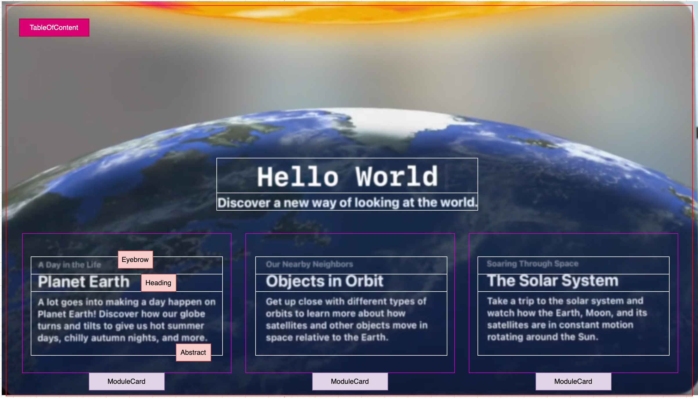

# Hello World 


[](https://docs-assets.developer.apple.com/published/efa8e7a0a97cfab20bf0f4c307b9b121/Hello-World-overview.mp4)


## 问题：
1. 3D 地球是怎么编程的？ 有3D的材料？ 
2. 行星绕地球是怎么编程的？ 


## 程序分解




### 
```swift
```

**知识点**：`@main` 是什么？


