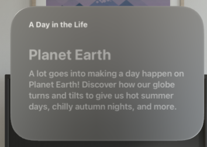

# 1.1 ModuleCard

## Requirement



`NavigationLink` : This is a navigation button. 


```swift
struct ModuleCard: View {
    var module: Module
    var body: some View {
        NavigationLink(value: module) {
            VStack(alignment: .leading, spacing: 4) {
                Text(module.eyebrow)
                    .font(.callout)
                    .bold()
                    .foregroundStyle(.secondary)
                
                VStack(alignment: .leading, spacing: 10) {
                    Text(module.heading)
                        .font(.largeTitle)
                    Text(module.abstract)
                }
                .padding(.vertical, 30)
            }
        }
        .buttonStyle(.borderless)
        .buttonBorderShape(.roundedRectangle(radius: 20))
        .frame(minWidth: 200, maxWidth: 355)
    }
}
                   
#Preview {
    HStack {
        ModuleCard(module: .globe)
//        ModuleCard(module: .orbit)
//        ModuleCard(module: .solar)
    }
    .padding()
    .glassBackgroundEffect()
}

```
