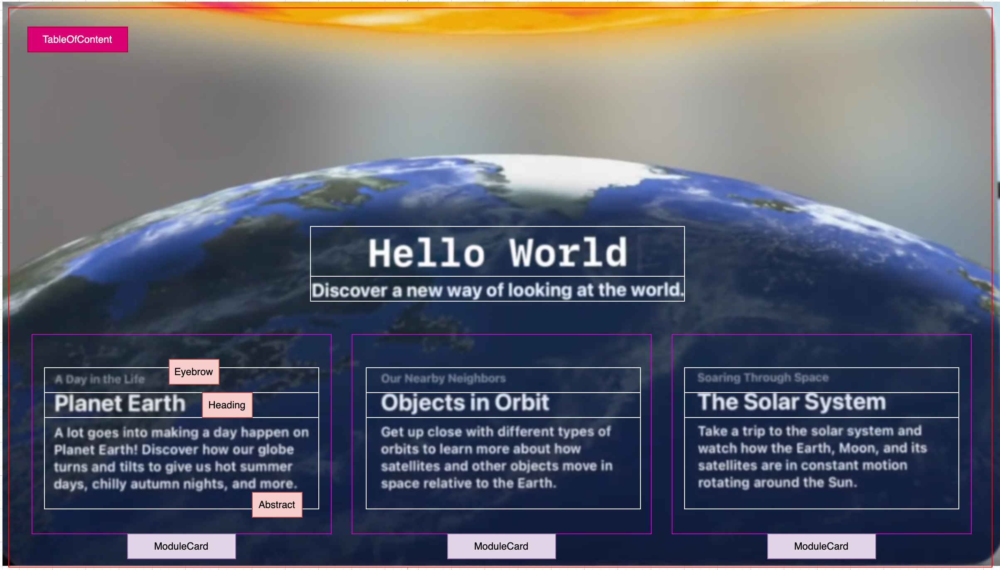

# Hello World 

### Questions:
1. How is a 3D Earth programmed? Are there 3D materials?
2. How is the programming for planets orbiting the Earth done?

### Resources

1. Asset
2. Package

### Decomposition

#### The Home Page

**Design Prototype**

**Step 1: ModuleCard View**
 including Eyebrow, Heading and Abstract

[Module Card implementation](./01_1_ModuleCard.md)

**Step 2: TableOfContent Page**

