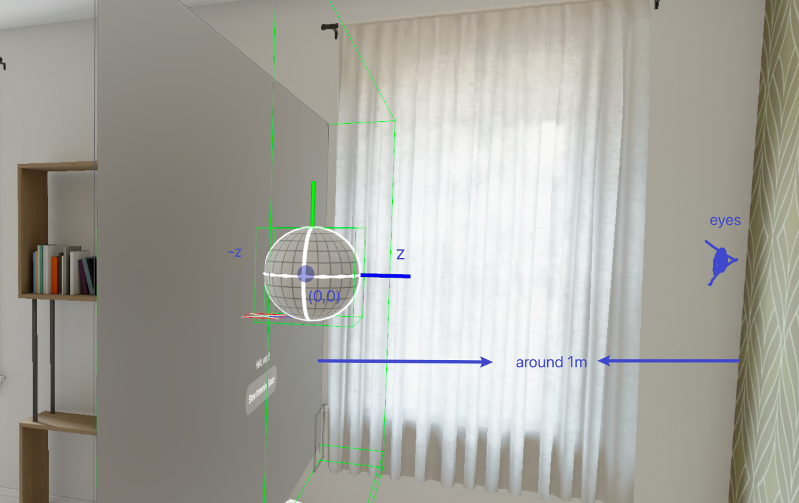

## Start from empty vision pro project

`xcode 16 beta3`, `vison os 2.0`


* What's the initial scene `Volume` and `Window`
* What's the immersive space renderer `RealityKit` and `Metal`
* What's the immersive Space `Full`, `Mixed`, `Progressive`


## Let's take a look examples


## Come back to Concepts


##  `Window, RealityKit and Mixed` App

file structure

```
├── l2-3dObj
│   ├── AppModel.swift
│   ├── ContentView.swift
│   ├── ImmersiveView.swift
│   └── l2_3dObjApp.swift
```


| File                             | Description                                    |
| -------------------------------- | ---------------------------------------------- |
| [xxx]App.swift                   | App main entrance                              |
| AppModel.swift                   | The App global data state to manage the states |
| ContentView.swift                |                                                |
| ImmersiveView.swift              |                                                |
| ToggleImmersiveSpaceButton.swift | Button Function                                |


### Main Entainence

The main maintenance include, 
1. Global App data state - `AppModel`
2. Body is a `Scene`
	1. `Scene` has `WindowGroup` and `ImmersiveSpace`.
	2. `Scene` can switch from `WindowGroup - ContentView` to `ImmersiveView()` via `AppModel` status. 

```swift
@main

struct MyApp: App {
    @State private var appModel = AppModel()

    var body: some Scene {
        WindowGroup {
            ContentView()
                .environment(appModel)
        }
        
        ImmersiveSpace(id: appModel.immersiveSpaceID) {
            ImmersiveView()
                .environment(appModel)
                .onAppear {
                    appModel.immersiveSpaceState = .open
                }
                .onDisappear {
                    appModel.immersiveSpaceState = .closed
                }
        }
        .immersionStyle(selection: .constant(.mixed), in: .mixed)
     }
}
```


### Window  Mode - ContentView

Sample App come with built-in package - `RealityKitContent`

Question: where is my view point? 


In Apple's visionOS, the default distance from the user viewpoint to the default 3D object is not explicitly defined in the available documentation. However, the system typically manages the positioning of windows and 3D objects automatically, and developers have limited control over setting specific distances directly.

1. Comfortable viewing size:  
    Apple recommends that most content should be sized so that it's comfortable to view at arm's length, which is typically about 47 cm (18.5 inches) from the user's eyes.
2. Window sizes:  
    For standard windows, Apple suggests a default size of about 1280 x 720 points. This translates to roughly 60 cm (23.6 inches) wide at arm's length.
3. Ornaments and smaller objects:  
    For smaller interactive elements like ornaments, Apple recommends a minimum size of about 60 x 60 points, which is about 2.8 cm (1.1 inches) at arm's length.
4. Dynamic sizing:  
    visionOS can automatically adjust the size of windows and objects based on their distance from the user, ensuring they remain comfortably visible.
5. Scale property:  
    When working with 3D models, you can use the `scale` property to adjust the size of your object. A scale of 1.0 represents the object's original size as imported.





**How to load 3D object in a Window View - swiftUI view" 

```swift

struct ContentView: View {
    private let url = URL(string: "https://developer.apple.com/augmented-reality/quick-look/models/biplane/toy_biplane_idle.usdz")!
    var body: some View {
        VStack {
            Model3D(named: "Scene", bundle: realityKitContentBundle)
                .padding(.bottom, 50)
            
            Model3D(url: url) { model in
	            model.model?.resizable()
		            .aspectRatio(contentMode: .fit)
	                .frame(width: 200, height: 200)
		    }
		    .padding(.bottom, 50)
            
            Text("Hello, world!")
            ToggleImmersiveSpaceButton()
        }
        .padding()
    }
}

```


**How to load 3D object in an immersive View - RealityView?"

```


```swift
//  1. create 3d object entity 
//  2. add the entity into RealityView
if let immersiveContentEntity = try? await Entity(named: "Immersive", in: realityKitContentBundle) {
    content.add(immersiveContentEntity)
}

```


`Window, RealityKit and Progressive` l
`Window, Reality and Immersive`


