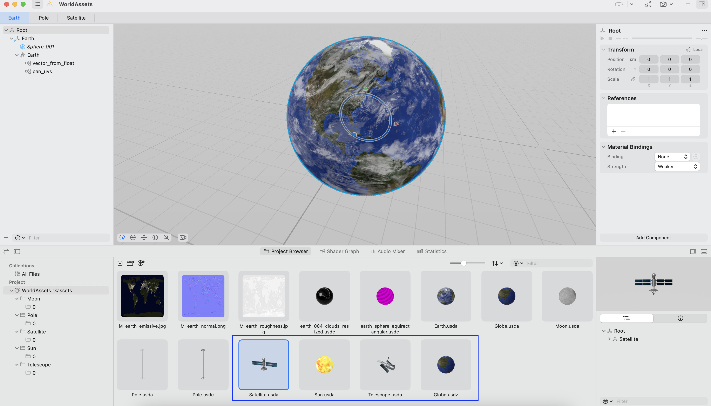

# How to load 3D Globe 

**Brief**

The 3D object can view in Reality Views. Before viewing, we need to load the the 3D `Entity`. 
In this `entity`, it defines the 3D objects and its children movement. 

**Keywords**

`RealityView`, `Entity`


**Finial View**


Questions: 
1. How to load 3D globe? 
2. How to make the globe move? 
3. How to make the satellite orbit globe? 
4. How to incline the globe?
5. How to make the globe rotate? 


## Beforehand 

**WorldAssets 3D Models Inspection** 

The `Entity` is the files with the suffix of `.usda`.  The `WorldAssets` packages  provide interface and attributes in swift source code. 




### Load 3D Object

* It needs to work with 3D asset package and predefined classes, in the case, it is `WorldAssets`

The Globe object has 3 entities, `Glboe`, `Pole`, `Satellites`, 

Let's take a look the objects entities
1. `earth` has two entities -  Earth (when Cloudy) and Globe (without Cloudy)
2. `Pole` directly load from WorldAsset Pole
3. `Satellite` has 4 relationship/configuration.
	1. A satellite in orbit around earth
	2. The moon in orbit around earth from earth viewpoint
	3. A space telescope in orbit around earth
	4. The moon in orbit around earth from solar viewpoint
4. `rotator` - provide day/night cycle
5. `equatorialPlane` provide equatorial that rotates 23.5 to create axial tilt. 

Relationship: 
```
EarthEntity 
	-> equatorialPlane
		-> rotator
			-> earth
				-> pole
		-> satellites
    -> moon
```


```swift

class EarthEntity: Entity {

    ...

    init(
        configuration: Configuration,
        satelliteConfiguration: [SatelliteEntity.Configuration],
        moonConfiguration: SatelliteEntity.Configuration?

    ) async {

        super.init()

        // Load the earth and pole models.
        guard let earth = await WorldAssets.entity(named: configuration.isCloudy ? "Earth" : "Globe"),

        let pole = await WorldAssets.entity(named: "Pole") else { return }

        self.earth = earth
        self.pole = pole

        // Create satellites.
        for configuration in satelliteConfiguration {
            await satellites.addChild(SatelliteEntity(configuration))
        }


        // Attach to the Earth to a set of entities that enable axial
        // tilt and a configured amount of rotation around the axis.
        self.addChild(equatorialPlane)
        equatorialPlane.addChild(rotator)
        rotator.addChild(earth)

        // Attach the pole to the Earth to ensure that it
        // moves, tilts, rotates, and scales with the Earth.
        earth.addChild(pole)

  
        // The Moon's orbit isn't affected by the tilt of the Earth, so attach
        // the Moon to the root entity.
        moon = await SatelliteEntity(.orbitMoonDefault)
        self.addChild(moon)


        // The inclination of artificial satellite orbits is measured relative
        // to the Earth's equator, so attach the satellite container to the
        // equatorial plane entity.
        equatorialPlane.addChild(satellites)

        // Configure everything for the first time.
        update(
            configuration: configuration,
            satelliteConfiguration: satelliteConfiguration,
            moonConfiguration: moonConfiguration,
            animateUpdates: false)
    }
}


